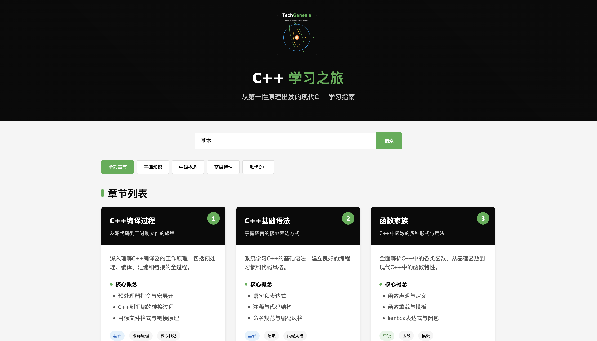
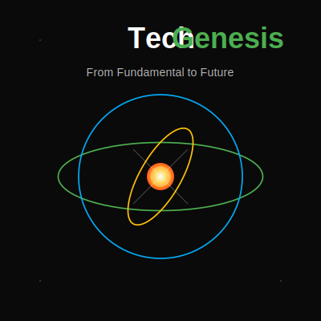

# 📚 C++ Learning Journey

<div align="center">
  <a href="https://ragnorli.github.io/Cpp101n/" target="_blank">
    
    <br>
    <b>👆 Click To Visit Cards Online 👆</b>
  </a>
</div>

<div align="center">


[](./CONTRIBUTING.md)

**Learning C++ from First Principles**  
*Based on learncpp.com content, but clearer, more focused, and systematic*

[English](./README.md) | [中文](./README_zh.md)

[Core Features](#-core-features) •
[Quick Start](#-quick-start) •
[Project Showcase](#-project-showcase) •
[Architecture Design](#-architecture-design) •
[Contributing](#-contributing) •
[Roadmap](#-roadmap)

<div align="center">
  
</div>

</div>

## 🌟 Why Choose This Project?

If you can't find a *card-based*, *chapter-structured*, *hands-on experiment-oriented* guide that **strictly follows first principles** as its fundamental framework!

> "- Observe the form, dissect the structure, understand the reason, practice the method!" — ragnor.li

**Target Audience:**
- 🎓 Computer Science students learning C++
- 💼 Professionals transitioning to C++ development
- 👨‍💻 Self-taught developers seeking structured practice
- 📝 Technical interview candidates preparing for programming challenges

## 🚀 Core Features

- **🧩 Clarity**: Each chapter's knowledge structure treats functions as first-class citizens, serving as both theory and experiment!
- **🔄 Focus**: Every namespace is like a mind map of interconnected knowledge, capturing both essence and context!
- **🛠️ Systematic**: Every programming language is a means of communication between humans and computers. Cpp101n strips away the commonalities with Python and Java, allowing you to examine different design philosophies from a C++ perspective! Marvel at the battle of ideas from those who came before!
- **🐊 Card-based**: Each chapter automatically generates HTML cards, facilitating team presentations and personal reference!

## ⚡ Quick Start

```bash
# Clone the repository
git clone https://github.com/RagnorLi/Cpp101n.git
cd Cpp101n

# Build the project
mkdir build && cd build
cmake ..
make

# List all chapters
./cPP101n

# Run a specific chapter
./cPP101n chapter01  # Basic C++ syntax
./cPP101n chapter07  # Pointers and references
./cPP101n chapter12  # Advanced classes and OOP
```

### IDE Setup (CLion)
1. Open the project in CLion
2. Add the chapter name (e.g., `chapter03`) in Program Arguments
3. Click Run or Debug to explore the chapter

## 📋 Learning Path

| Chapter | Topic | Core Concepts | Difficulty | Application Scenarios | Related Technologies | Project Demo | Status |
|------|------|---------|------|---------|---------|---------|------|
| 00 | 🔧 **Compiler Principles** | Preprocessing, Lexical Analysis, Syntax Analysis, Semantic Analysis, IR Generation, Optimization, Code Generation | 🌟🌟🌟 | Compiler Development, Language Design | LLVM, Clang, GCC | Mini Compiler | ✅ |
| 01 | 🚀 **C++ Compilation Process** | Compilation Flow, Assembly Conversion, Compiler Comparison, Linking Principles | 🌟 | Build Systems, Cross-compilation | CMake, Make, Ninja | Build Process Visualization | ✅ |
| 02 | 📝 **Syntax Basics** | Statements, Expressions, Comments, Variables, Naming, Operators, Return Values | 🌟 | All C++ Programs | Coding Standards, Static Analysis | Advanced Hello World | ✅ |
| 03 | 🧩 **Function Family** | Definition-scope Functions, Special-purpose Functions, Constrained Functions, Polymorphic Functions, Generic Functions | 🌟🌟 | API Design, Library Development | std::function, Function Pointers | Function Factory | ✅ |
| 04 | 📁 **File Type Taxonomy** | Source Files, Header Files, Precompiled Headers, Object Files, Library Files, Executables | 🌟🌟 | Project Architecture, Modularity | Modules, Namespaces | Project Skeleton Generator | ✅ |
| 05 | 🐛 **Debugging & Error Handling** | Memory Errors, Concurrency Errors, Type Errors, Resource Management, Performance Issues | 🌟🌟🌟 | Software Quality Assurance | GDB, LLDB, Valgrind | Error Diagnosis Tool | ✅ |
| 06 | 🧠 **Data Type System** | Basic Types, Compound Types, User Types, Standard Library Types, C++20 Specific Types | 🌟🌟 | Data Modeling, Type Design | Type Traits, Concepts | Type Analyzer | ✅ |
| 07 | 🔄 **Type Conversion Art** | Implicit Conversion, Explicit Conversion, Safe Conversion, Ownership Transfer | 🌟🌟 | Interface Design, API Integration | Type Traits, SFINAE | Type Conversion Toolkit | ✅ |
| 08 | ➗ **Operator Deep Dive** | Arithmetic, Relational, Bitwise, Member Access, Special Operators, C++20 Operators | 🌟🌟 | DSL Design, Expression Templates | Operator Overloading, Expression Templates | Math Library | ✅ |
| 09 | ⏱️ **Variable Lifecycle** | Declaration, Allocation, Initialization, Usage, Destruction, RAII Pattern | 🌟🌟 | Resource Management, Memory Optimization | Smart Pointers, Move Semantics | Memory Tracker | ✅ |
| 10 | 🔀 **Advanced Control Flow** | Sequential Flow, Branching, Loop Iteration, Exception Handling, Coroutines | 🌟🌟 | Algorithm Implementation, State Machines | std::ranges, coroutines | State Machine Engine | ✅ |
| 11 | ⚠️ **Error Handling Strategies** | Compile-time Detection, Runtime Detection, Exception Safety, Error Codes, Contracts | 🌟🌟 | Robust Systems, Secure Software | std::expected, std::optional | Error Handling Framework | ✅ |
| 12 | 🧪 **Test-Driven Development** | Unit Testing, Integration Testing, Mock Objects, Test Coverage, CI/CD | 🌟🌟 | Software Quality, Continuous Integration | Catch2, GoogleTest | Test Suite Generator | ✅ |
| 13 | 🏗️ **Object-Oriented Deep Dive** | Encapsulation, Inheritance, Polymorphism, RAII, Virtual Function Mechanism, Design Patterns | 🌟🌟🌟 | Large System Design | vtables, CRTP | Framework Design Demo | ✅ |
| 14 | 📦 **Containers & Collections** | Sequence Containers, Associative Containers, Unordered Containers, Views, Iterators | 🌟🌟 | Data Structures, Algorithms | std::vector, std::map | Data Structure Visualization | ✅ |
| 15 | 💾 **Memory Management Art** | Memory Layout, Allocation Strategies, Object Lifecycle, Smart Pointers, Memory Barriers | 🌟🌟🌟 | Performance Optimization, Resource-constrained Environments | std::allocator, Memory Pools | Custom Memory Allocator | ✅ |
| 16 | 👉 **Pointer Mastery** | Pointer Types, Pointer Arithmetic, Smart Pointers, Memory Safety, Pointer Pitfalls | 🌟🌟🌟 | Systems Programming, Driver Development | unique_ptr, shared_ptr | Safe Pointer Library | ✅ |
| 17 | 📐 **Template Metaprogramming** | Type Templates, Function Templates, SFINAE, Variadic Templates, Concept Constraints | 🌟🌟🌟🌟 | Generic Libraries, Compile-time Computation | Metafunctions, Type Traits | Compile-time Computation Framework | ✅ |
| 18 | 📊 **I/O Streams & Serialization** | Stream Model, File I/O, Formatting, Binary I/O, Network I/O | 🌟🌟 | Data Persistence, Network Communication | iostream, fstream | Serialization Engine | ✅ |
| 19 | 🧰 **STL In-Depth Analysis** | Container Principles, Iterator Design, Algorithm Implementation, Function Objects, Ranges | 🌟🌟🌟 | Generic Algorithms, Data Processing | Algorithm, Ranges | Custom STL Implementation | ✅ |
| 20 | 🤖 **Large Models & C++** | Inference Engines, Quantization, Hardware Acceleration, Distributed Parallel Computing | 🌟🌟🌟🌟 | AI Applications, High-performance Computing | CUDA, TensorRT | Lightweight Inference Engine | ✅ |
| 21 | ⚡ **Concurrency & Parallel Programming** | Threads, Synchronization Primitives, Atomic Operations, Memory Model, Lock Design | 🌟🌟🌟 | High-performance Services, Real-time Systems | std::thread, async | Thread Pool Implementation | 🔜 |
| 22 | λ **Functional Programming** | Pure Functions, Immutability, Higher-order Functions, Function Pipelines, Monads | 🌟🌟🌟 | Data Flow Processing, Reactive Programming | std::function, Lambda | Functional Data Processing Library | 🔜 |
| 23 | 📘 **Design Patterns & Architecture** | Creational Patterns, Structural Patterns, Behavioral Patterns, Architectural Patterns | 🌟🌟🌟 | Maintainable Systems, Large Projects | Factory, Observer, MVVM | Design Pattern Catalog | 🔜 |
| 24 | ⚡ **Performance Optimization Mastery** | Data Locality, CPU Cache, Branch Prediction, SIMD, Parallelism | 🌟🌟🌟🌟 | Game Engines, Scientific Computing | AVX, OpenMP | Performance Benchmark Suite | 🔜 |
| 25 | 🌐 **Network Programming** | Sockets, Async I/O, Protocol Stacks, HTTP Clients, RPC | 🌟🌟🌟 | Network Services, Distributed Systems | Asio, gRPC | Microservice Framework | 🔜 |
| 26 | 🎮 **Graphics & Gaming** | Rendering Pipeline, Physics Engine, Audio Processing, Input Handling | 🌟🌟🌟🌟 | Game Development, Visualization | OpenGL, Vulkan | Mini Game Engine | 🔜 |
| 27 | 📱 **Cross-platform Development** | Platform Abstraction, Conditional Compilation, GUI Frameworks, Mobile Development | 🌟🌟🌟 | Desktop Applications, Mobile Apps | Qt, wxWidgets | Cross-platform APP | 🔜 |
| 28 | 🔄 **Modern C++ Ecosystem** | Package Management, Build Systems, CI/CD, Static Analysis, Documentation | 🌟🌟🌟 | Open Source Projects, Team Collaboration | Conan, vcpkg, CMake | Project Template Generator | 🔜 |
| 29 | 🏆 **Large Project Practice** | Architecture Design, Performance Tuning, Code Quality, Release Management | 🌟🌟🌟🌟 | Commercial Software, System Software | Full-stack C++ Technologies | Comprehensive Application System | 🔜 |

## 🎯 Project Showcase

<div align="center">

<p><em>Visualized memory layout from Chapter 4: Pointer Visualization</em></p>
</div>

```cpp
// From Chapter 12: Smart Pointers in Action
auto resource = std::make_unique<Resource>("precious");
std::cout << "Resource created successfully: " << resource->getName() << std::endl;
auto shared = std::make_shared<DataBlock>(1024);
std::weak_ptr<DataBlock> observer = shared;
// See what happens when shared goes out of scope!
```

## 🏗️ Architecture Design

This project employs a unique chapter runner system that allows each module to exist independently while maintaining a unified structure:

```
Cpp101n/
├── CMakeLists.txt
├── main.cpp                # Unified entry point
├── chapter_runner.h/cpp    # Coordination manager
├── chapters/
│   ├── chapter01/          # Each chapter is independent
│   │   ├── chapter01.h
│   │   ├── chapter01.cpp
│   ├── chapter02/
│   │   ├── chapter02.h
│   │   ├── chapter02.cpp
│   │   └── ...
│   └── ...
└── utils/                  # Shared visualization tools
```

### Design Principles

- **Zero Dependencies**: Each chapter relies only on the standard library
- **Compiler Compatibility**: Compatible with GCC, Clang, and MSVC
- **Progressive Disclosure**: Complex topics build upon previous knowledge
- **Visual Feedback**: Console visualizations for abstract concepts

## 👥 Contributing

Your contributions will make this learning journey even better! Here are ways you can help:

- Add new chapters covering C++ topics
- Improve existing examples or explanations
- Fix bugs or enhance the chapter runner
- Add memory/performance visualizations
- Translate comments into other languages

See [CONTRIBUTING.md](./CONTRIBUTING.md) for detailed guidelines.

## 🗺️ Roadmap

- [ ] Complete all 29 core chapters
- [ ] Add interactive quizzes after each section
- [ ] Create heap/stack memory usage visualization tools
- [ ] Develop integrated benchmarking tools
- [ ] Support C++20 concepts and modules

## 📜 License

This project is licensed under the MIT License - see the [LICENSE](./LICENSE) file for details.
```