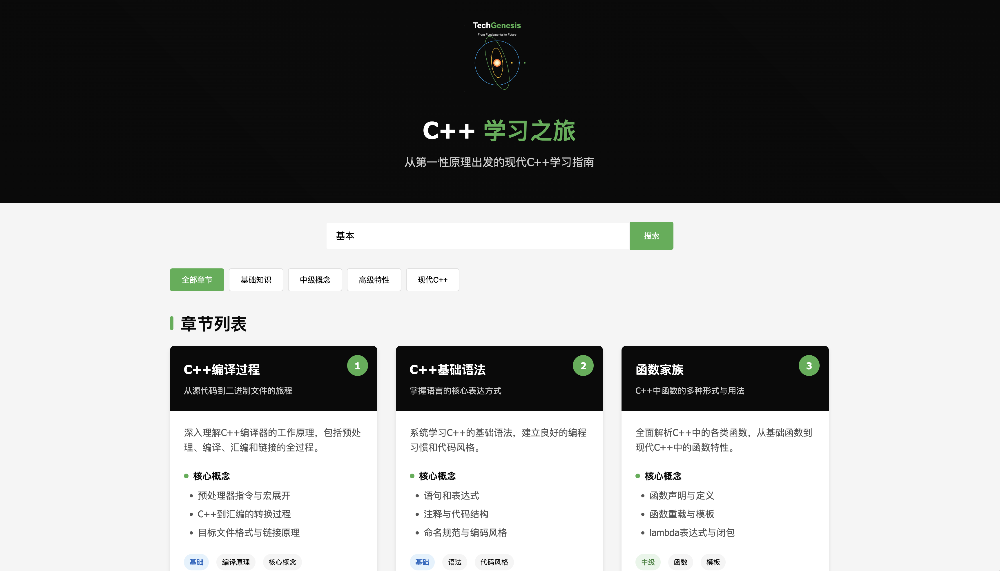

# 📚 C++ 学习之旅

<div align="center">
  <a href="https://ragnorli.github.io/Cpp101n/" target="_blank">
    
    <br>
    <b>👆 点击图片访问在线学习平台 👆</b>
  </a>
</div>

<div align="center">
<br>


[](./CONTRIBUTING.md)

**第一性原理学C++**  
*基于learncpp.com的内容，但更清晰、核心、系统*

[English](./README.md) | [中文](./README_zh.md)

[核心特性](#-核心特性) •
[快速开始](#-快速开始) •
[项目展示](#-项目展示) •
[架构设计](#-架构设计) •
[参与贡献](#-参与贡献) •
[发展规划](#-发展规划)

<div align="center">
  
</div>

</div>

## 🌟 为什么选择本项目？

如果你找不到一份*卡片式* *章节式* *动手实验导向* 并**严格遵循第一性原理**作为基本骨架的秘籍！

> "- 观其形 剖其骨 知其因 练其方！" — ragnor.li

**适合人群：**
- 🎓 学习C++的计算机科学学生
- 💼 转向C++开发的专业人士
- 👨‍💻 希望获得结构化练习的自学开发者
- 📝 准备编程挑战的技术面试者

## 🚀 核心特性

- **🧩 清晰**：每一个章节的知识骨架都把函数作为一等公民，既是理论又是实验！
- **🔄 核心**：每一个namespace都是思维导图式的知识串联，既是精华又是脉络！
- **🛠️ 系统**：每一门语言都是人类与计算机沟通的方式，Cpp101n剥离出Python、Java与其共通之处，你会从C++视角审视不同的设计精华！感叹前人的思想博弈！
- **🐊  卡片**：每一个章节都自动生成HTML卡片，便于团队内部演示，更便于自我检索！

## ⚡ 快速开始

```bash
# 克隆仓库
git clone https://github.com/RagnorLi/Cpp101n.git
cd Cpp101n

# 构建项目
mkdir build && cd build
cmake ..
make

# 列出所有章节
./cPP101n

# 运行特定章节
./cPP101n chapter01  # 基础C++语法
./cPP101n chapter07  # 指针与引用
./cPP101n chapter12  # 高级类与面向对象编程
```

### IDE设置 (CLion)
1. 在CLion中打开项目
2. 在Program Arguments中添加章节名（如`chapter03`）
3. 点击Run或Debug来探索该章节

## 📋 学习路径


| 章节 | 主题 | 核心概念 | 难度 | 应用场景 | 相关技术 | 项目演示 | 状态 |
|------|------|---------|------|---------|---------|---------|------|
| 00 | 🔧 **编译器原理** | 预处理、词法分析、语法分析、语义分析、IR生成、优化、代码生成 | 🌟🌟🌟 | 编译器开发、语言设计 | LLVM、Clang、GCC | 迷你编译器 | ✅ |
| 01 | 🚀 **C++编译过程** | 编译流程、汇编转换、编译器比较、链接原理 | 🌟 | 构建系统、交叉编译 | CMake、Make、Ninja | 构建流程可视化 | ✅ |
| 02 | 📝 **语法基础** | 语句、表达式、注释、变量、命名、运算符、返回值 | 🌟 | 所有C++程序 | 代码规范、静态分析 | Hello World进阶 | ✅ |
| 03 | 🧩 **函数家族** | 定义位置函数、特殊用途函数、约束函数、多态函数、泛型函数 | 🌟🌟 | API设计、库开发 | std::function、函数指针 | 函数工厂 | ✅ |
| 04 | 📁 **文件类型族谱** | 源文件、头文件、预编译头、目标文件、库文件、可执行文件 | 🌟🌟 | 项目架构、模块化 | 模块、命名空间 | 项目骨架生成器 | ✅ |
| 05 | 🐛 **调试与错误处理** | 内存错误、并发错误、类型错误、资源管理、性能问题 | 🌟🌟🌟 | 软件质量保证 | GDB、LLDB、Valgrind | 错误诊断工具 | ✅ |
| 06 | 🧠 **数据类型系统** | 基本类型、复合类型、用户类型、标准库类型、C++20特有类型 | 🌟🌟 | 数据建模、类型设计 | 类型萃取、概念 | 类型分析器 | ✅ |
| 07 | 🔄 **类型转换艺术** | 隐式转换、显式转换、安全转换、所有权转换 | 🌟🌟 | 接口设计、API集成 | 类型特征、SFINAE | 类型转换工具箱 | ✅ |
| 08 | ➗ **运算符深度解析** | 算术、关系、位、成员访问、特殊运算符、C++20运算符 | 🌟🌟 | DSL设计、表达式模板 | 运算符重载、表达式模板 | 数学库 | ✅ |
| 09 | ⏱️ **变量生命周期** | 声明、分配、初始化、使用、销毁、RAII模式 | 🌟🌟 | 资源管理、内存优化 | 智能指针、移动语义 | 内存跟踪器 | ✅ |
| 10 | 🔀 **控制流高级技术** | 顺序流、分支选择、循环迭代、异常处理、协程 | 🌟🌟 | 算法实现、状态机 | std::ranges、coroutines | 状态机引擎 | ✅ |
| 11 | ⚠️ **错误处理策略** | 编译期检测、运行时检测、异常安全、错误码、契约 | 🌟🌟 | 健壮系统、安全软件 | std::expected、std::optional | 错误处理框架 | ✅ |
| 12 | 🧪 **测试驱动开发** | 单元测试、集成测试、模拟对象、测试覆盖率、CI/CD | 🌟🌟 | 软件质量、持续集成 | Catch2、GoogleTest | 测试套件生成器 | ✅ |
| 13 | 🏗️ **面向对象精深** | 封装、继承、多态、RAII、虚函数机制、设计模式 | 🌟🌟🌟 | 大型系统设计 | 虚函数表、CRTP | 框架设计演示 | ✅ |
| 14 | 📦 **容器与集合** | 序列容器、关联容器、无序容器、视图、迭代器 | 🌟🌟 | 数据结构、算法 | std::vector、std::map | 数据结构可视化 | ✅ |
| 15 | 💾 **内存管理艺术** | 内存布局、分配策略、对象生命周期、智能指针、内存栅栏 | 🌟🌟🌟 | 性能优化、资源受限环境 | std::allocator、内存池 | 定制内存分配器 | ✅ |
| 16 | 👉 **指针精通之路** | 指针类型、指针算术、智能指针、内存安全、指针陷阱 | 🌟🌟🌟 | 系统编程、驱动开发 | unique_ptr、shared_ptr | 安全指针库 | ✅ |
| 17 | 📐 **模板元编程** | 类型模板、函数模板、SFINAE、变参模板、概念约束 | 🌟🌟🌟🌟 | 泛型库、编译期计算 | 元函数、类型萃取 | 编译期计算框架 | ✅ |
| 18 | 📊 **I/O流与序列化** | 流模型、文件I/O、格式化、二进制I/O、网络I/O | 🌟🌟 | 数据持久化、网络通信 | iostream、fstream | 序列化引擎 | ✅ |
| 19 | 🧰 **STL深度剖析** | 容器原理、迭代器设计、算法实现、函数对象、Ranges | 🌟🌟🌟 | 通用算法、数据处理 | Algorithm、Ranges | STL定制实现 | ✅ |
| 20 | 🤖 **大模型与C++** | 推理引擎、量化优化、硬件加速、分布式并行 | 🌟🌟🌟🌟 | AI应用、高性能计算 | CUDA、TensorRT | 轻量推理引擎 | ✅ |
| 21 | ⚡ **并发与并行编程** | 线程、同步原语、原子操作、内存模型、锁设计 | 🌟🌟🌟 | 高性能服务、实时系统 | std::thread、async | 线程池实现 | 🔜 |
| 22 | λ **函数式编程** | 纯函数、不变性、高阶函数、函数管道、单子 | 🌟🌟🌟 | 数据流处理、响应式编程 | std::function、Lambda | 函数式数据处理库 | 🔜 |
| 23 | 📘 **设计模式与架构** | 创建型模式、结构型模式、行为型模式、架构模式 | 🌟🌟🌟 | 可维护系统、大型项目 | 工厂、观察者、MVVM | 设计模式目录 | 🔜 |
| 24 | ⚡ **性能优化精通** | 数据局部性、CPU缓存、分支预测、SIMD、并行 | 🌟🌟🌟🌟 | 游戏引擎、科学计算 | AVX、OpenMP | 性能基准套件 | 🔜 |
| 25 | 🌐 **网络编程** | Socket、异步I/O、协议栈、HTTP客户端、RPC | 🌟🌟🌟 | 网络服务、分布式系统 | Asio、gRPC | 微服务框架 | 🔜 |
| 26 | 🎮 **图形与游戏** | 渲染管线、物理引擎、音频处理、输入处理 | 🌟🌟🌟🌟 | 游戏开发、可视化 | OpenGL、Vulkan | 迷你游戏引擎 | 🔜 |
| 27 | 📱 **跨平台开发** | 平台抽象、条件编译、GUI框架、移动开发 | 🌟🌟🌟 | 桌面应用、移动应用 | Qt、wxWidgets | 跨平台APP | 🔜 |
| 28 | 🔄 **现代C++生态** | 包管理、构建系统、CI/CD、静态分析、文档 | 🌟🌟🌟 | 开源项目、团队协作 | Conan、vcpkg、CMake | 项目模板生成器 | 🔜 |
| 29 | 🏆 **大型项目实战** | 架构设计、性能调优、代码质量、发布管理 | 🌟🌟🌟🌟 | 商业软件、系统软件 | 全栈C++技术 | 综合应用系统 | 🔜 |


## 🎯 项目展示

<div align="center">

<p><em>章节4中的可视化内存布局：指针可视化</em></p>
</div>

```cpp
// 来自章节12：智能指针实战
auto resource = std::make_unique<Resource>("precious");
std::cout << "资源创建成功：" << resource->getName() << std::endl;
auto shared = std::make_shared<DataBlock>(1024);
std::weak_ptr<DataBlock> observer = shared;
// 看看shared超出作用域后会发生什么！
```

## 🏗️ 架构设计

本项目采用独特的章节运行器系统，使每个模块独立存在的同时保持统一的结构：

```
Cpp101n/
├── CMakeLists.txt
├── main.cpp                # 统一入口
├── chapter_runner.h/cpp    # 协调管理器
├── chapters/
│   ├── chapter01/          # 每个章节都是独立的
│   │   ├── chapter01.h
│   │   ├── chapter01.cpp
│   ├── chapter02/
│   │   ├── chapter02.h
│   │   ├── chapter02.cpp
│   │   └── ...
│   └── ...
└── utils/                  # 共享可视化工具
```

### 设计原则

- **零依赖**：每个章节只依赖标准库
- **编译器兼容性**：兼容GCC、Clang和MSVC
- **渐进式揭示**：复杂主题基于前面的知识构建
- **视觉反馈**：为抽象概念提供控制台可视化

## 👥 参与贡献

您的贡献将使这个学习之旅更加精彩！以下是您可以帮助的方式：

- 添加涵盖C++主题的新章节
- 改进现有示例或解释
- 修复错误或增强章节运行器
- 添加内存/性能可视化
- 将注释翻译成其他语言

详细指南请参阅[CONTRIBUTING.md](./CONTRIBUTING.md)。

## 🗺️ 发展规划

- [ ] 完成全部29个核心章节
- [ ] 每个部分后添加互动测验
- [ ] 创建堆/栈内存使用可视化工具
- [ ] 开发集成的基准测试工具
- [ ] 支持C++20概念和模块

## 📜 许可证

本项目采用MIT许可证 - 详情请参阅[LICENSE](./LICENSE)文件。