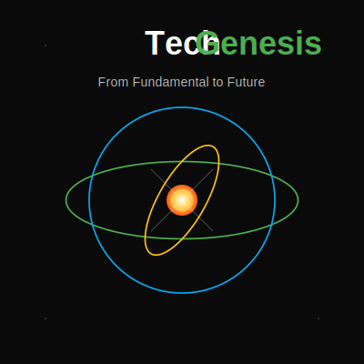

# 📚 C++ 学习之旅

<div align="center">


[](./CONTRIBUTING.md)

**第一性原理学C++**  
*基于learncpp.com的内容，但更清晰、核心、系统*

[English](./README.md) | [中文](./README_zh.md)

[核心特性](#-核心特性) •
[快速开始](#-快速开始) •
[项目展示](#-项目展示) •
[架构设计](#-架构设计) •
[参与贡献](#-参与贡献) •
[发展规划](#-发展规划)

<div align="center">
  
</div>

</div>

## 🌟 为什么选择本项目？

如果你找不到一份*卡片式* *章节式* *动手实验导向* 并**严格遵循第一性原理**作为基本骨架的秘籍！

> "- 观其形 剖其骨 知其因 练其方！" — ragnor.li

**适合人群：**
- 🎓 学习C++的计算机科学学生
- 💼 转向C++开发的专业人士
- 👨‍💻 希望获得结构化练习的自学开发者
- 📝 准备编程挑战的技术面试者

## 🚀 核心特性

- **🧩 清晰**：每一个章节的知识骨架都把函数作为一等公民，既是理论又是实验！
- **🔄 核心**：每一个namespace都是思维导图式的知识串联，既是精华又是脉络！
- **🛠️ 系统**：每一门语言都是人类与计算机沟通的方式，Cpp101n剥离出Python、Java与其共通之处，你会从C++视角审视不同的设计精华！感叹前人的思想博弈！
- **🐊  卡片**：每一个章节都自动生成HTML卡片，便于团队内部演示，更便于自我检索！

## ⚡ 快速开始

```bash
# 克隆仓库
git clone https://github.com/RagnorLi/Cpp101n.git
cd Cpp101n

# 构建项目
mkdir build && cd build
cmake ..
make

# 列出所有章节
./cPP101n

# 运行特定章节
./cPP101n chapter01  # 基础C++语法
./cPP101n chapter07  # 指针与引用
./cPP101n chapter12  # 高级类与面向对象编程
```

### IDE设置 (CLion)
1. 在CLion中打开项目
2. 在Program Arguments中添加章节名（如`chapter03`）
3. 点击Run或Debug来探索该章节

## 📋 学习路径

| 章节 | 主题 | 涵盖的概念 | 知识卡 |
|---------|-------|------------------|------------------|
| 01 | C++基础 | 变量、类型、控制流 |a|
| 02 | 函数与作用域 | 参数传递、返回值 |
| 03 | 数组与字符串 | 迭代、操作、C与C++对比 |a|
| 04 | 指针可视化 | 内存模型、指针算术 |a|
| ... | ... | ... | ... |
| 17 | 现代C++ | 移动语义、智能指针、RAII |a|

## 🎯 项目展示

<div align="center">

<p><em>章节4中的可视化内存布局：指针可视化</em></p>
</div>

```cpp
// 来自章节12：智能指针实战
auto resource = std::make_unique<Resource>("precious");
std::cout << "资源创建成功：" << resource->getName() << std::endl;
auto shared = std::make_shared<DataBlock>(1024);
std::weak_ptr<DataBlock> observer = shared;
// 看看shared超出作用域后会发生什么！
```

## 🏗️ 架构设计

本项目采用独特的章节运行器系统，使每个模块独立存在的同时保持统一的结构：

```
Cpp101n/
├── CMakeLists.txt
├── main.cpp                # 统一入口
├── chapter_runner.h/cpp    # 协调管理器
├── chapters/
│   ├── chapter01/          # 每个章节都是独立的
│   │   ├── chapter01.h
│   │   ├── chapter01.cpp
│   ├── chapter02/
│   │   ├── chapter02.h
│   │   ├── chapter02.cpp
│   │   └── ...
│   └── ...
└── utils/                  # 共享可视化工具
```

### 设计原则

- **零依赖**：每个章节只依赖标准库
- **编译器兼容性**：兼容GCC、Clang和MSVC
- **渐进式揭示**：复杂主题基于前面的知识构建
- **视觉反馈**：为抽象概念提供控制台可视化

## 👥 参与贡献

您的贡献将使这个学习之旅更加精彩！以下是您可以帮助的方式：

- 添加涵盖C++主题的新章节
- 改进现有示例或解释
- 修复错误或增强章节运行器
- 添加内存/性能可视化
- 将注释翻译成其他语言

详细指南请参阅[CONTRIBUTING.md](./CONTRIBUTING.md)。

## 🗺️ 发展规划

- [ ] 完成全部29个核心章节
- [ ] 每个部分后添加互动测验
- [ ] 创建堆/栈内存使用可视化工具
- [ ] 开发集成的基准测试工具
- [ ] 支持C++20概念和模块

## 📜 许可证

本项目采用MIT许可证 - 详情请参阅[LICENSE](./LICENSE)文件。